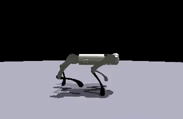

# See it, Do it, Sorted. : Quadruped Skill Synthesis from Single Video Demonstration

<div align="center">

<!-- [[Website]](https://eureka-research.github.io/dr-eureka/) -->
<!-- [[arXiv]](https://arxiv.org/abs/2406.01967) -->
<!-- [[PDF]](https://eureka-research.github.io/dr-eureka/assets/dreureka-paper.pdf) -->

[Jeffrey Li](https://jelipenguin.github.io/),

University College London

</div>

The Official

## Table of Content:

- [See it, Do it, Sorted. : Quadruped Skill Synthesis from Single Video Demonstration](#see-it-do-it-sorted--quadruped-skill-synthesis-from-single-video-demonstration)
  - [Table of Content:](#table-of-content)
  - [To Start](#to-start)
  - [Installation](#installation)
  - [Running SDS](#running-sds)
  - [Results Overview](#results-overview)
    - [Quadruped Trotting](#quadruped-trotting)
    - [Dog Running](#dog-running)
    - [Deer Pronking](#deer-pronking)
    - [Horse Pacing](#horse-pacing)
    - [Horse Walking](#horse-walking)
  - [Acknowledgements](#acknowledgements)
  - [Citation](#citation)

## To Start

Clone this repository and its submodules

```
git clone --recursive <repo>
```

## Installation

1. Create a new Conda:
   ```
   conda create -n masters python=3.8
   ```
   ```
   conda activate masters
   ```
2. Install Pytorch with CUDA:
   ```
   pip3 install torch torchvision torchaudio --index-url https://download.pytorch.org/whl/cu121
   ```
3. Install the project:
   ```
   pip install -e .
   ```
   ```
   cd easy_ViTPose && pip install -e . && mkdir checkpoints
   ```
   ```
   cd ../forward_locomotion_sds && pip install -e . && cd ..
   ```
4. Download ViTPose++ model checkpoint from huggingface
   ```
   wget https://huggingface.co/JunkyByte/easy_ViTPose/resolve/main/torch/ap10k/vitpose-h-ap10k.pth -P easy_ViTPose/checkpoints
   ```

## Running SDS

```
cd SDS
```

```
python sds.py task=[walk,run,hop,pace,trot]
```

Make sure to add your OpenAI API Key at agents.py

## Results Overview

#### Quadruped Trotting

| [Demonstration](https://www.youtube.com/watch?v=2H3dzZEi-qw) | SDS Trained                                               |
| ------------------------------------------------------------ | --------------------------------------------------------- |
|       |  |

#### Dog Running

| [Demonstration](https://www.youtube.com/watch?v=A8YPHoc0dR0&pp=ygULZG9nIHJ1bm5pbmc%3D) | SDS Trained                                                |
| -------------------------------------------------------------------------------------- | ---------------------------------------------------------- |
|                                   |  |

#### Deer Pronking

| [Demonstration](https://www.youtube.com/watch?v=49fz_WKBrXo) | SDS Trained                                             |
| ------------------------------------------------------------ | ------------------------------------------------------- |
|         |  |

#### Horse Pacing

| [Demonstration](https://www.youtube.com/watch?v=SMmcGUSUSA0&t=44s) | SDS Trained                                              |
| ------------------------------------------------------------------ | -------------------------------------------------------- |
|              |  |

#### Horse Walking

| [Demonstration](https://www.youtube.com/watch?v=RV9P0w8vZi8&t=11s) | SDS Trained                                              |
| ------------------------------------------------------------------ | -------------------------------------------------------- |
|              |  |

## Acknowledgements

- Agent training and simulation were done in [IsaacGym](https://developer.nvidia.com/isaac-gym).
- The code is built upon the "[DrEureka: Language Model Guided Sim-to-Real Transfer](https://github.com/eureka-research/DrEureka)" codebase.

## Citation

```bibtex
@article{li2024sds,
    title   = {See it. Do it. Sorted.: Quadruped Skill Synthesis from Single Video Demonstration},
    author  = {Jeffrey Li}
    year    = {2024},
}
```
