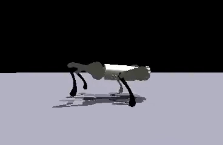
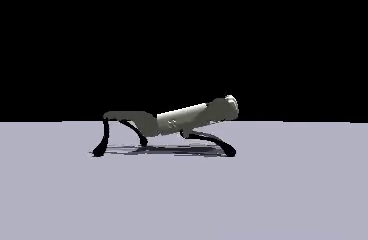
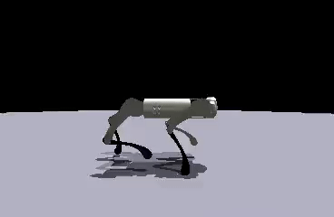

# See it, Do it, Sorted. : Quadruped Skill Synthesis from Single Video Demonstration

<div align="center">

<!-- [[Website]](https://eureka-research.github.io/dr-eureka/) -->
<!-- [[arXiv]](https://arxiv.org/abs/2406.01967) -->
<!-- [[PDF]](https://eureka-research.github.io/dr-eureka/assets/dreureka-paper.pdf) -->

[Jeffrey Li*](https://jelipenguin.github.io/), [Maria Stamatopoulou*](https://maniast.github.io/), [Dimitrios Kanoulas](https://dkanou.github.io/)

Robot Perception and Learning (RPL) , University College London

</div>
In this work we present See it. Do it. Sorted.: Quadruped Skill Synthesis from Single Video Demonstration. We provide a simulation environemnt to train low-level skill policies from demonstration videos, using the GPT-4o VLM. We also offer a pipeline to implemnet the learned skills on the on-board GPU of the real robot agent. 

## Results Overview

#### Quadruped Trotting
| [Demonstration](https://www.youtube.com/watch?v=2H3dzZEi-qw) | SDS Trained                                              | Real-World                                               |
| ------------------------------------------------------------ | ---------------------------------------------------------|--------------------------------------------------------- |
|       |  |  |

#### Dog Bounding

| [Demonstration](https://www.youtube.com/watch?v=A8YPHoc0dR0&pp=ygULZG9nIHJ1bm5pbmc%3D) | SDS Trained                                                | Real-World                                               |
| -------------------------------------------------------------------------------------- | ---------------------------------------------------------- |--------------------------------------------------------- |
|                                   |  |  |

#### Deer Hopping

| [Demonstration](https://www.youtube.com/watch?v=49fz_WKBrXo) | SDS Trained                                             | Real-World                                               |
| ------------------------------------------------------------ | ------------------------------------------------------- |--------------------------------------------------------- |
|         |  |  |

#### Horse Pacing

| [Demonstration](https://www.youtube.com/watch?v=SMmcGUSUSA0&t=44s) | SDS Trained                                              | Real-World                                               |
| ------------------------------------------------------------------ | -------------------------------------------------------- |--------------------------------------------------------- |
|              |  |  |


## Table of Content:

- [See it, Do it, Sorted. : Quadruped Skill Synthesis from Single Video Demonstration](#see-it-do-it-sorted--quadruped-skill-synthesis-from-single-video-demonstration)
  - [Table of Content:](#table-of-content)
  - [To Start](#to-start)
  - [Installation](#installation)
  - [Running SDS](#running-sds)
  - [Real World Deployment](#real-world-deployment)
  - [Acknowledgements](#acknowledgements)
  - [Citation](#citation)


## To Start

Clone this repository and its submodules

```
git clone --recursive https://github.com/RPL-CS-UCL/SDS.git
``

## Installation

1. Create a new Conda Environmnet:
   ```
   conda create -n sds python=3.8
   ```
   ```
   conda activate sds
   ```
2. Install Pytorch with CUDA:
   ```
   pip3 install torch torchvision torchaudio --index-url https://download.pytorch.org/whl/cu121
   ```
3. Install the project:
   ```
   pip install -e .
   ```
   ```
   cd easy_ViTPose && pip install -e . && mkdir checkpoints
   ```
   ```
   cd ../forward_locomotion_sds && pip install -e . && cd ..
   ```
4. Download ViTPose++ model checkpoint from huggingface
   ```
   wget https://huggingface.co/JunkyByte/easy_ViTPose/resolve/main/torch/ap10k/vitpose-h-ap10k.pth -P easy_ViTPose/checkpoints
   ```

## Running SDS
Make sure to add your OpenAI API Key at agents.py

```
cd SDS
```

```
python sds.py task=[walk,run,hop,pace,trot]
```


## Real-World Deployment 
Our deployment infrastructure is based on [Walk These Ways](https://github.com/Improbable-AI/walk-these-ways). 

1. Add the (relative) path to your checkpoint to `forward_locomotion/go1_gym_deploy/scripts/deploy_policy.py`. Note that you can have multiple policies at once and switch between them.
2. Start up the Go1, and connect to it on your machine via Ethernet of Wifi. Make sure you can ssh onto the NX (`192.168.123.15`).
3. Put the robot into damping mode with the controller: L2+A, L2+B, L1+L2+START. The robot should be lying on the ground with the motors moving freely and there should be no sound.
4. Run the following on your computer to send the checkpoint and code to the Go1:
   ```
   cd forward_locomotion/go1_gym_deploy/scripts
   ./send_to_unitree.sh
   ```
5. Now, ssh onto the robot and run the following:
   ```
   chmod +x installer/install_deployment_code.sh
   cd ~/go1_gym/go1_gym_deploy/scripts
   sudo ../installer/install_deployment_code.sh
   ```
6. Make sure your robot is in a safe location and hung up. Start the SDK of the robot to allow communication of low-level commands. 
   ```
   cd ~/go1_gym/go1_gym_deploy/autostart
   ./start_unitree_sdk.sh
   ```
7. In a second terminal, start the docker by running:
   ```
   cd ~/go1_gym/go1_gym_deploy/docker
   sudo make autostart && sudo docker exec -it foxy_controller bash
   ```
8. This should open a docker image. Within it, run:
   ```
   cd /home/isaac/go1_gym && rm -r build && python3 setup.py install
   
9. Install dependancies: 
   cd go1_gym_deploy/scripts/params_proto_installation/ && python3 install_dependencies.py 

10. Run the policy 
   ```
   cd .. 
   python3 deploy_policy.py --skill="trot" # this could be ["trot","bound", "hop","pace"] according to the skill. In the function run_policy.py different control values can be overwritten and changed according to the experiment.
   ```
11. Now, you can press R2 on the controller, and the robot should move on the nominal joint configuration, dictated by the go1_config function in deploy_policy.py.
12. Pressing R2 again will start the policy.
13. If you want to pause the policy and at anytime return back to nominal configuration press R2 at anytime.


## Acknowledgements

- Agent training and simulation were done in [IsaacGym](https://developer.nvidia.com/isaac-gym).
- The code is built upon the "[DrEureka: Language Model Guided Sim-to-Real Transfer](https://github.com/eureka-research/DrEureka)" codebase.

## Citation

```bibtex
@article{li2024sds,
    title   = {See it. Do it. Sorted.: Quadruped Skill Synthesis from Single Video Demonstration},
    author  = {Jeffrey Li*, Maria Stamatopoulou*, Dimitrios Kanoulas}
    year    = {2024},
}
```
